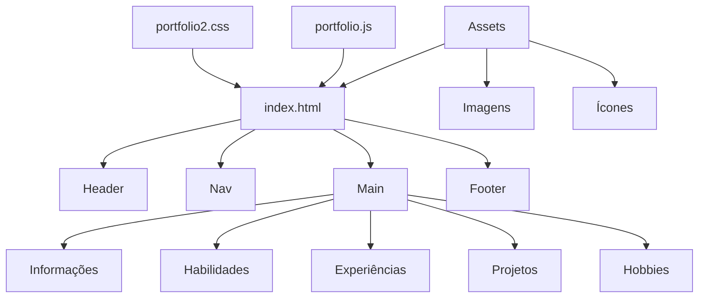
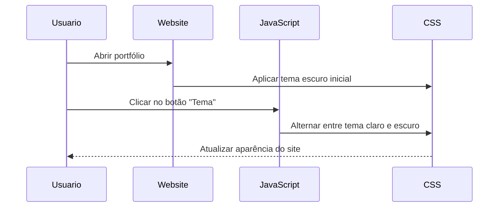
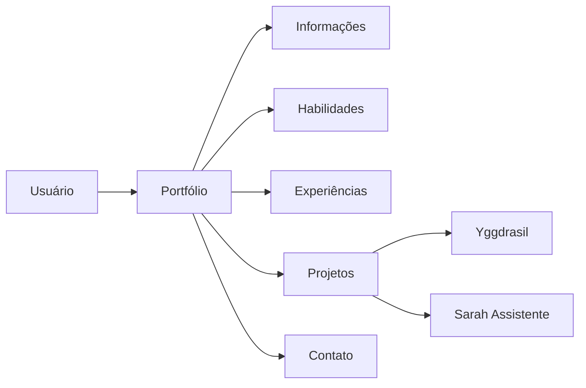

# 🌐 Projeto Portfólio — Website Pessoal Responsivo

Website desenvolvido utilizando **HTML5**, **CSS3** e **JavaScript** com foco em apresentar informações pessoais, habilidades, experiências e projetos de forma organizada, moderna e responsiva.

O objetivo do projeto é servir como um **portfólio pessoal online**, permitindo a divulgação de projetos, tecnologias dominadas e informações de contato através de uma interface intuitiva e adaptável para diferentes dispositivos.

---

# 📌 Funcionalidades

- 🏠 Página inicial personalizada  
- 🎨 Alternância dinâmica entre tema claro e escuro  
- 📱 Layout responsivo para dispositivos móveis  
- 👤 Sessão de informações pessoais  
- 🛠 Exibição de habilidades técnicas  
- 📚 Área de experiências  
- 🚀 Sessão de projetos com links externos  
- 🔗 Integração com GitHub  
- 📞 Área de contato no rodapé  

---

# 🧰 Tecnologias Utilizadas

| Tecnologia | Função |
|---|---|
| HTML5 | Estruturação do site |
| CSS3 | Estilização e responsividade |
| JavaScript | Interatividade e troca de temas |
| Git | Controle de versão |
| GitHub | Hospedagem do repositório |

---

# 🏗 Arquitetura do Sistema

A aplicação segue uma estrutura modular simples separando:

- **HTML** → Estrutura da aplicação  
- **CSS** → Estilização e responsividade  
- **JavaScript** → Manipulação de eventos e temas  
- **Assets** → Imagens, ícones e mídias do projeto  







---

# 🎨 Sistema de Temas

O projeto possui suporte para:

- 🌙 Tema Escuro  
- ☀️ Tema Claro  

A troca de tema é realizada dinamicamente utilizando JavaScript através da alteração de classes no elemento `<body>`.

```javascript
function alterar_tema() {
    var body = document.body;

    if (body.classList.contains("escuro")){
        body.classList.remove("escuro");
        body.classList.add("claro");
    }
    else{
        body.classList.remove("claro");
        body.classList.add("escuro");
    }
}
```

---

# 📱 Responsividade

O site foi desenvolvido utilizando **Media Queries** para adaptação automática em diferentes resoluções:

- 💻 Computadores  
- 📱 Smartphones  
- 📟 Tablets  

O menu de navegação adapta automaticamente sua estrutura em telas menores garantindo melhor experiência para o usuário.

---

# 🚀 Projetos Destacados

## 🌳 Yggdrasil

Projeto desenvolvido em **HTML**, **CSS** e **JavaScript** com foco em conectar ONGs e adotantes de animais.

### Funcionalidades:

- Sistema de filtros por espécie  
- Busca por idade  
- Filtro por raça  
- Interface intuitiva para adoção  

### Repositório:

https://github.com/Muzgeist/Yggdrasil

---

## 🤖 Sarah — Assistente IA

Projeto pessoal focado no desenvolvimento de uma assistente virtual inteligente.

### Funcionalidades:

- Leitura de arquivos  
- Resumos automáticos  
- Criação e exclusão de arquivos  
- Pesquisas aprofundadas  
- Integração com APIs de IA  

Atualmente utilizando integração com API da Groq.

### Repositório:

https://github.com/Muzgeist/Sarah-Assistente

---

# 📂 Estrutura do Projeto

```plaintext
portfolio/
│
├── index.html
│
├── css/
│   └── portfolio2.css
│
├── js/
│   └── portfolio.js
│
├── img/
│   ├── Lucas.jpg
│   └── GitHub-Logo.jpg
│
├── ico/
│   └── user.ico
│
└── README.md
```

---

# 🎓 Finalidade

Este projeto foi desenvolvido com finalidade educacional aplicando conceitos de:

- Desenvolvimento Web  
- Estruturação semântica com HTML5  
- Estilização avançada com CSS3  
- Responsividade  
- Manipulação do DOM com JavaScript  
- Organização de projetos front-end  

---

# 📖 Documentação Técnica

## Como clonar o projeto

```bash
git clone https://github.com/Muzgeist/seu-repositorio.git
```

---

## Como executar o projeto

1. Clone o repositório  
2. Abra a pasta do projeto  
3. Execute o arquivo `index.html` em qualquer navegador moderno  

---

# 📬 Contato

- 📧 Email: Felipe@ficticio.com  
- 📱 Telefone: (31) 985818619  
- 💻 GitHub: https://github.com/Muzgeist  

---

# 📜 Licença

Projeto desenvolvido para fins educacionais e pessoais.